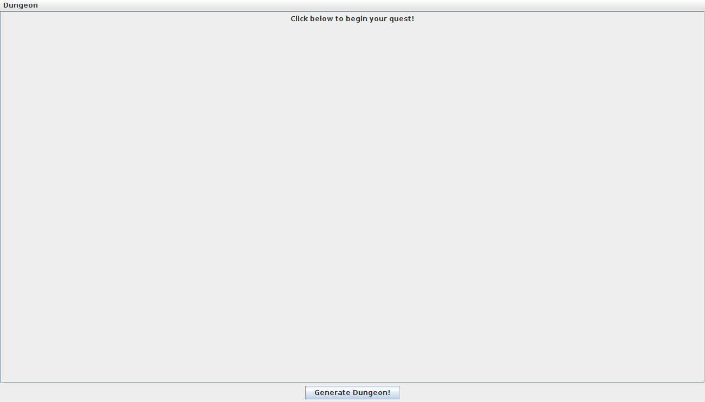
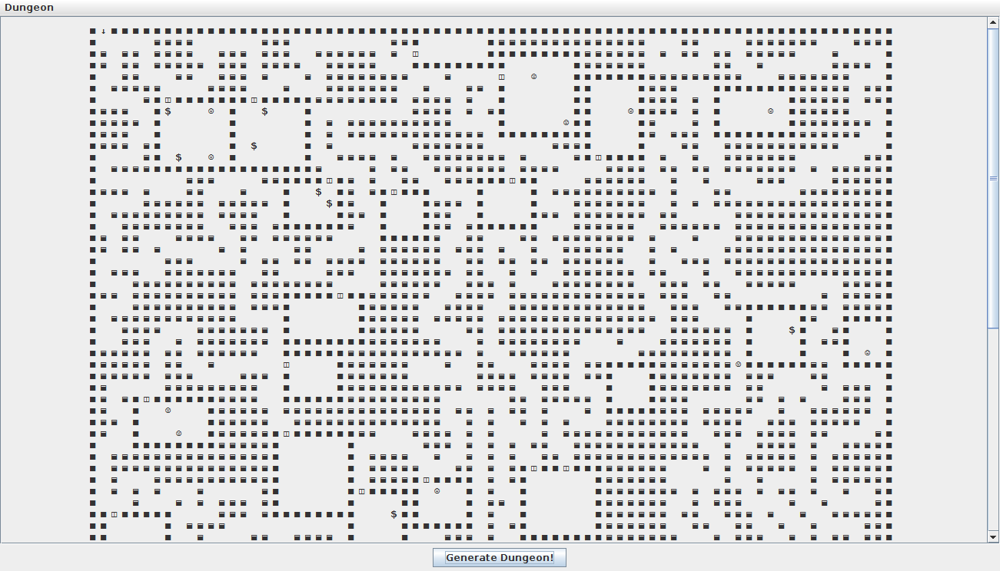
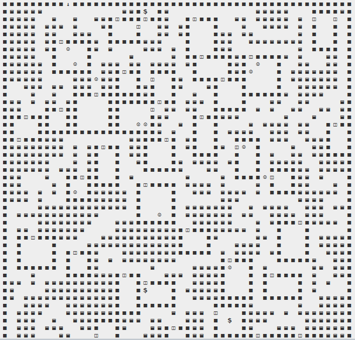

# WillowQuest - Mitch Powell candidate project.

My candidate submission project consists of a runnable .jar file that should be executable
through a command line command of "java -jar <path to jar file>". The only dependency that
is required is Java 8.

When run, the program will start up a Swing-library-based GUI, with a button at the bottom
to generate a dungeon. In the top left corner, there is a drop down menu, where you can
choose to open a pop-up menu that allows you to adjust the room density, number of monsters,
amount of treasure, and dungeon size. The dungeon generated has an entrance at the top,
an exit at the bottom, and a slew of corridors, rooms, treasures and monsters in between.

The program was written using a builder design pattern, with adherence to the SOLID design
principles. Each of the components was decoupled through interface dependency injection, any
of the pieces can be exchanged/mocked with another class that implements the interface in
any way that it sees fit. This is conducive to the maintainability, and unit-testability
of the project.

All source code can be viewed at my public GitHub account at http://www.github.com/mitchpowell1/WillowQuest

Note: I have had a friend tell me that he has had some issues with the spacing in the display. I have
added an alternative version that replaces empty hallways (previously space characters) with a white
square. Hopefully that will fix the issue (I can't reproduce it on my machine so it is hard to tell).

I have attached some screenshots of the display on my machine just in case you experience the same issue.

## Screenshots

